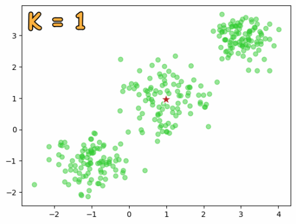

# K-Means

    <figure>
        
        <figcaption>Your caption goes here</figcaption>
    </figure>

KMeans is an iterative clustering algorithm that aims to partition a set of data points into \( K \) non-overlapping subgroups (clusters), where each data point belongs to the cluster with the nearest mean. The algorithm can be described in a few key steps:

1. **Initialization**: Choose \( K \) initial cluster centers (centroids). This can be done randomly, by selecting \( K \) random data points, or by other initialization methods.
  
2. **Assignment**: Assign each data point to the nearest centroid. The distance is usually calculated using Euclidean distance, but other metrics can be used.

3. **Update**: Recalculate the centroids by computing the mean of all the data points in each cluster.

4. **Convergence Check**: Repeat the assignment and update steps until the centroids don't change significantly or a maximum number of iterations is reached.

## Use Cases of KMeans:

1. **Market Segmentation**: Businesses use KMeans to segment customers based on purchasing behavior, demographics, etc., to tailor marketing strategies for each segment.

2. **Image Compression**: Representing an image with fewer colors, where the colors are determined by cluster centers.

3. **Anomaly Detection**: In some contexts, data points that don't fit well into any cluster might be considered anomalies or outliers.

4. **Document Clustering**: Grouping documents based on term occurrences.

5. **Spatial Data Analysis**: Identifying locations for facilities like warehouses, hospitals, etc., based on clustering geographic data.

The power of KMeans comes from its simplicity, but it has some limitations. For example, it assumes that clusters are spherical and equally sized, which may not be the case in many real-world datasets. Also, KMeans can get stuck in local minima, so it's often run multiple times with different initializations.
