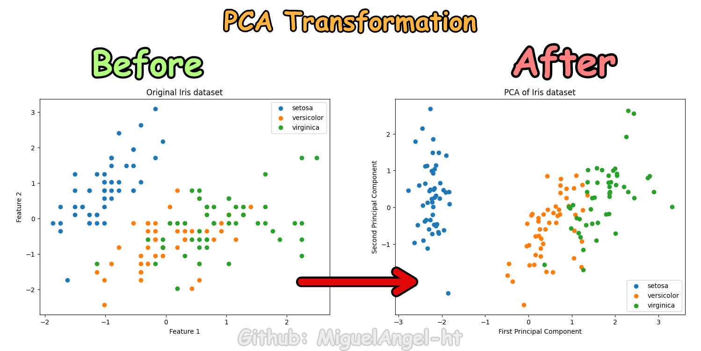

# PCA (Principal Component Analysis) Overview

## What is PCA?
PCA, or Principal Component Analysis, is a statistical method used to reduce the dimensionality of data. By transforming the original variables into a new set of orthogonal variables (the principal components), PCA captures the most significant patterns in the data without needing to use all original variables.

   <figure>
       
       
Example of transformation of data with PCA's

   </figure>

## How does PCA work?
1. **Standardization**: The data is standardized to have a mean of 0 and a standard deviation of 1.
2. **Covariance Matrix Computation**: A covariance matrix is computed from the standardized data.
3. **Eigen Decomposition**: Eigenvalues and eigenvectors are derived from the covariance matrix.
4. **Sort By Eigenvalue**: The eigenvectors are ranked by their corresponding eigenvalues in descending order.
5. **Data Projection**: The data is projected onto the top 'k' eigenvectors to get 'k' principal components, where 'k' is less than or equal to the original number of variables.

## What kind of problems can PCA solve?

PCA is predominantly used for:

* *Dimensionality Reduction*: Reducing the number of variables while retaining most of the original data's variance.
* *Data Visualization*: Making high-dimensional data more visually interpretable by reducing it to 2D or 3D.
* *Noise Reduction*: By focusing on the primary components of variance, PCA can help filter out noise.
* *Feature Extraction*: Deriving new features that might be more informative than the original ones.

## Classification of 2 features of original data vs. transformed data with PCA
By comparing the classification results on two original features versus two principal components, one can observe potential benefits in terms of model simplicity, accuracy, or even computational efficiency. In some cases, the PCA-transformed data may lead to clearer decision boundaries, aiding in better model performance.

## Applications of PCA
- ***Image Compression***: Representing images with fewer bits while retaining their main features.
- ***Genomic Data Analysis***: Handling vast amounts of gene expression data.
- ***Finance***: Reducing the number of variables in risk modeling or for portfolio optimization.
- ***Speech Recognition***: Reducing the complexity of audio features for better model performance.
