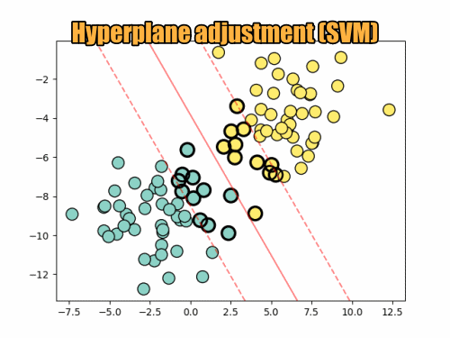

# Support Vector Machine (SVM)

## What is SVM?

Support Vector Machine (SVM) is a type of supervised learning algorithm that is used for classification and regression tasks. It works by finding the optimal hyperplane or decision boundary that separates the classes of data points with the maximum margin. In the case of two-dimensional data, the hyperplane is a line that divides the data points of different classes better as possible.

## Maths Involved in This Algorithm

The fundamental idea behind SVM is to find the optimal hyperplane which maximizes the margin between two classes. The equation of the hyperplane is represented as:

**$\overrightarrow{\omega} \cdot \overrightarrow{x} - b =0$**

where $\overrightarrow{\omega}$ is the normal vector to the hyperplane, $\overrightarrow{x}$ are the input features, and $b$ is the bias. The objective is to minimize

**$\frac{1}{2} \left\| \overrightarrow{\omega}\right\| {^2}$**

subject to the constraint

**$y_i (\overrightarrow{\omega} \cdot \overrightarrow{x_i} - b) \ge  1$**, for all $i$

Here, $y_i$ are the labels, $\overrightarrow{x_i}$ are the data points, and $i$ indexes over all data points.

   <figure>
       
       
Adjustment of Hyperplane in SVM increasing C parameter

   </figure>

## What is the Hyperplane and How to Obtain It?

A hyperplane is a decision boundary that best separates the classes of data points. For a 2-D space, it is a line and for a 3-D space, it is a plane, and so on. SVM finds this hyperplane using the support vectors, which are the data points closest to the decision boundary. The optimal hyperplane is obtained where the distance between the support vectors and the hyperplane is maximized, leading to a maximum margin classifier.

## Where Can I Use This Algorithm for Solving Problems?

* Text classification problems such as spam detection, sentiment analysis.
* Image classification for handwriting recognition, facial recognition, etc.
* In bioinformatics, for protein classification, cancer classification.
* In financial sectors for stock market price trend forecasting.

## 💚 Pros:

* Effective in high dimensional spaces.
* Works well when there is a clear margin of separation between classes.
* It is memory efficient as it uses a subset of training points (support vectors).

## 💔 Cons:

* Not suitable for larger datasets as the training time can be long.
* Less effective when the classes overlap.
* The choice of the kernel and tuning of parameters can be complex.

